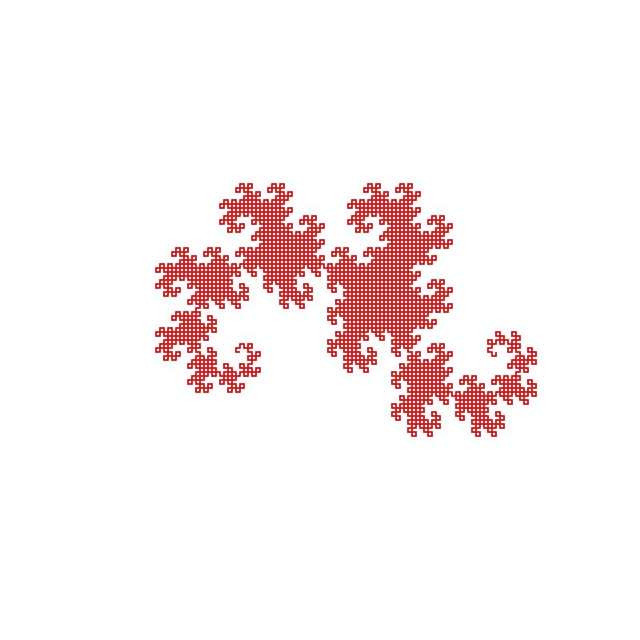

# pinky-go

A tree-walking interpreter written in Go for the Pinky programming language.

## Build and Test

```shell
go build
go test
```

## Run

```shell
go run ./cmd/pinky-go ./program.pinky
go run ./cmd/pinky-go ./program.pinky --verbose
```

To build a local executable and run it directly:

```shell
go build -o pinky-go ./cmd/pinky-go
./pinky-go ./program.pinky
./pinky-go ./program.pinky --verbose
```

To install the executable into your Go bin directory and use it like a normal command:

```shell
go install github.com/aybarsnazlica/pinky-go/cmd/pinky-go@latest
pinky-go ./program.pinky
pinky-go ./program.pinky --verbose
```

## Use as a Library

```go
package main

import (
 "fmt"

 pinky "github.com/aybarsnazlica/pinky-go"
)

func main() {
 result := pinky.RunSource(pinky.SampleProgram, true)
 if !result.Success {
  fmt.Printf("%s error on line %d: %s\n", result.ErrorType, result.ErrorLine, result.ErrorMessage)
  return
 }

 fmt.Print(result.Output)
}
```

The root package exposes the lexer, parser, AST, interpreter, runner, and sample program.

## Code Examples

Here is one example that I like to run with it.

### Dragon Curve

```lua
angle := 0
x := 25
y := 60

func pow(base, exponent)
 ret base ^ exponent
end

func factorial(n)
 res := 1.0
 for i := 1, n do
  res := res * i
 end
 ret res
end

func cos(a)
 a := a % 360
 if a == 0   then ret  1.0 end
 if a == 90  then ret  0.0 end
 if a == 180 then ret -1.0 end
 if a == 270 then ret  0.0 end
 if a == 360 then ret  1.0 end
 ret -99999
end

func sin(a)
 a := a % 360
 if a == 0   then ret  0.0 end
 if a == 90  then ret  1.0 end
 if a == 180 then ret  0.0 end
 if a == 270 then ret -1.0 end
 if a == 360 then ret  0.0 end
 ret -99999
end

func dragon(size, level, d)
 if level == 0 then
  x := x - cos(angle) * size
  y := y + sin(angle) * size
  println '    L ' + x + ' ' + y
 else
  dragon(size / 1.4142135624, level - 1, 1)
  angle := angle - d * 90
  dragon(size / 1.4142135624, level - 1, -1)
 end
end

println '<svg'
println '    xmlns="http://www.w3.org/2000/svg"'
println '    width="800"'
println '    height="800"'
println '    viewBox="-50 -50 200 200"'
println '    style="background-color:black">'
println ''
println '  <path'
println '    d="'
println '      M 25 60'
dragon(80, 12, 1)
println '    "'
println '    stroke="red"'
println '    stroke-width="0.5"'
println '    fill="none" />'
println '</svg>'
```


